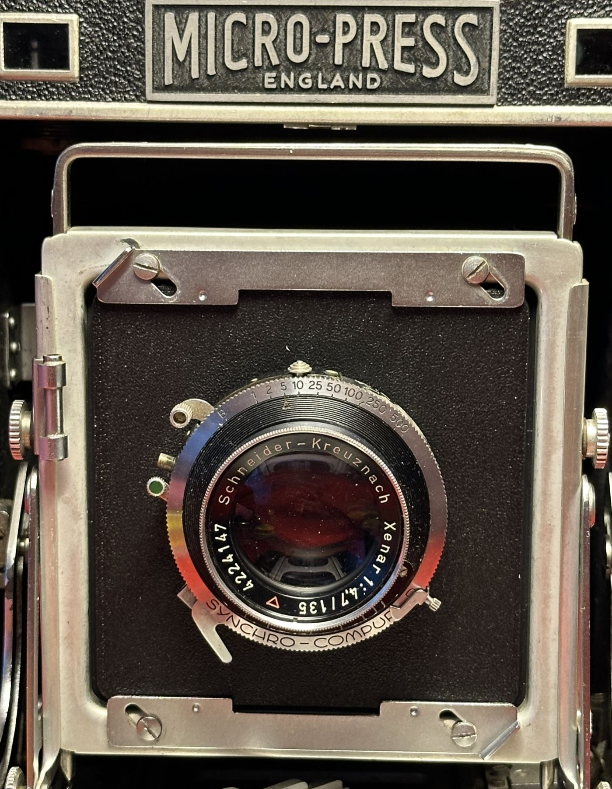
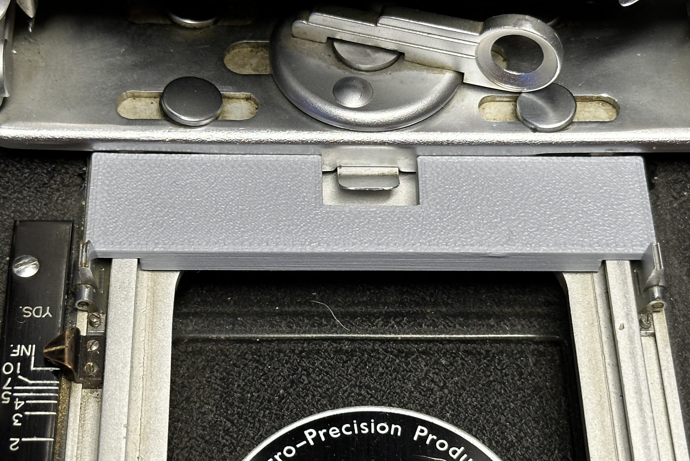

# MPP-camera-resources
Printable resources for MPP larger format camera owners.

## Lensboard for MPP Micro-Press

This is a printable lensboard that takes the Copal size shutter. I had a lot of fun getting the thickness just right. Best printed with a fair amount of infill. 
## Lomo Graflok Back Spacer

If you want to use a Lomo Graflok back with your MPP Micro-Press camera you need to adjust the position of the front standard because the film plane is 19mm further back inside the film holder. If you put this 19mm spacer in front of the lens standard it adds the correct offset to the front standard. It means that you can still focus with the rangefinder and the Graflok back and get good results. 

Remember that if you have this spacer fitted you will need to use the Lomographic Spacer on the back of the camera if you want to focus using ground glass.

Note that there is one small problem, which is that when the camera is focused at infinity it is not quite possible to open the sports finder on the front standard as it is too far back into the canera body. But apart from that it works well. 

You can find the STL files in the appropriate folders. I've also added the FreeCAD and OpenSCAD design files if you fancy tweaking them.

Have fun

Rob Miles

[www.robmiles.com](https://www.robmiles.com)
